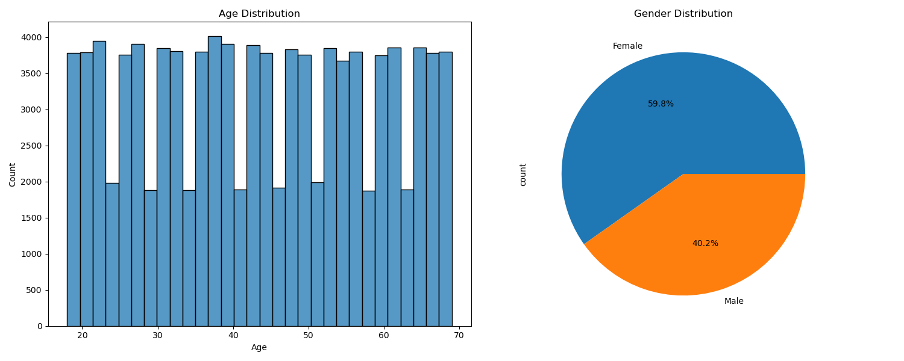
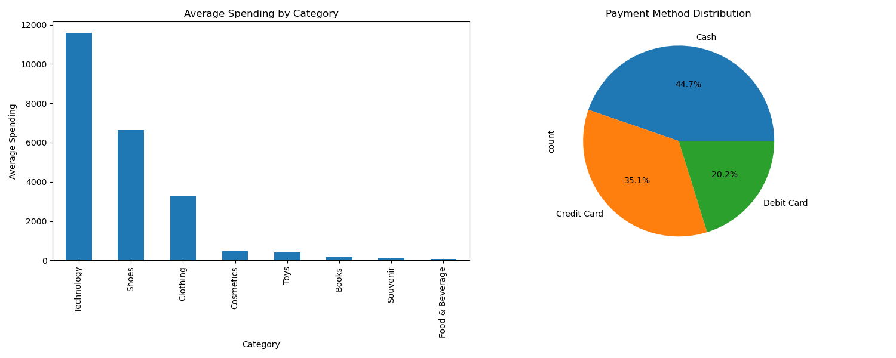
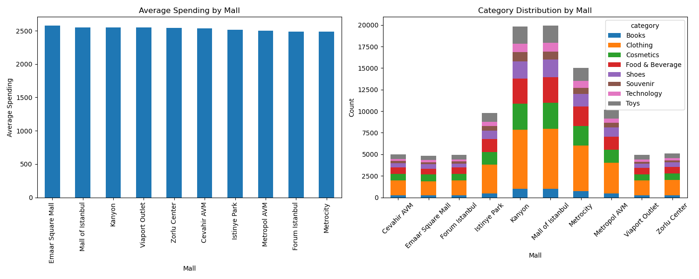
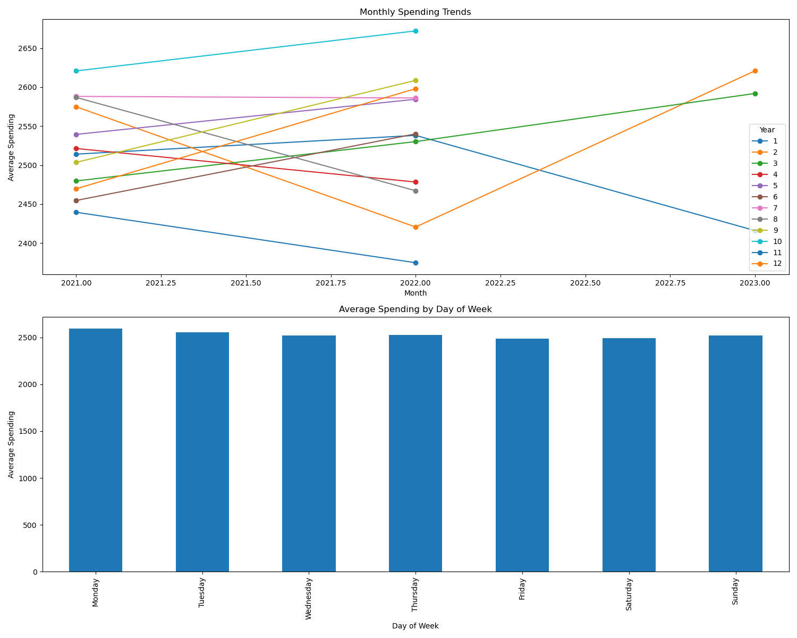
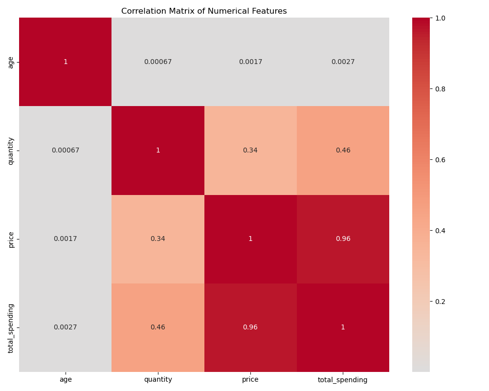

# Istanbul Shopping and Tourism Analysis

## Project Overview
This project analyzes Istanbul's retail and tourism sectors using machine learning and data analytics techniques. The analysis focuses on understanding customer behaviors, mall operations, and tourism trends to provide actionable insights for business optimization.

## Dataset Description
The analysis utilizes a comprehensive dataset of customer shopping data from Istanbul (2021-2023), containing:
- Customer demographics (age, gender)
- Transaction details (invoice ID, date, payment method)
- Product information (category, quantity, price)
- Location data (shopping mall name)

## Analysis Methodology

### 1. Data Preprocessing
The raw data underwent several preprocessing steps:
- Conversion of temporal features (year, month, day, day of week)
- Calculation of total transaction amounts
- Handling of missing values and data type standardization

### 2. Customer Segmentation Analysis
Using K-means clustering, customers were segmented into four distinct groups based on:
- Total spending
- Visit frequency
- Average transaction value
- Shopping patterns


*Space for interpretation of segment characteristics and business implications*

### 3. Purchase Prediction Modeling
A Random Forest Regressor was implemented to predict customer spending patterns, considering:
- Product categories
- Payment methods
- Mall locations
- Temporal features

Model Performance Metrics:
- Mean Squared Error (MSE)
- Root Mean Squared Error (RMSE)
- R-squared Score


*Space for interpretation of model accuracy and predictive power*

### 4. Demographic Analysis
The analysis revealed key insights about customer demographics:


*Space for interpretation of age and gender-based shopping patterns*

### 5. Spending Pattern Analysis
Detailed examination of spending behaviors across:
- Product categories
- Mall locations
- Time periods


*Space for interpretation of product preferences and spending behaviors*

### 6. Mall Performance Analysis
Analysis of mall-specific metrics and performance:


*Space for interpretation of mall performance and customer distribution*

### 7. Temporal Trends
Analysis of shopping patterns over time:


*Space for interpretation of temporal patterns and seasonal trends*

### 8. Correlation Analysis
Investigation of relationships between:
- Spending and demographics
- Product categories and customer segments
- Temporal patterns and purchase behaviors


*Space for interpretation of key correlations and relationships*

## Key Findings
1. Customer Segments:
   - High-value frequent shoppers
   - Moderate-value regular customers
   - Occasional shoppers
   - Budget-conscious customers

2. Purchase Patterns:
   - Peak shopping periods
   - Preferred product categories
   - Payment method preferences

3. Mall Performance:
   - Revenue distribution
   - Customer traffic patterns
   - Product category success

## Business Implications
1. Inventory Management:
   - Optimize stock levels based on segment preferences
   - Align product offerings with customer demographics

2. Marketing Strategies:
   - Target specific customer segments
   - Personalize promotions based on shopping patterns

3. Mall Operations:
   - Optimize store layouts
   - Enhance customer experience
   - Improve revenue distribution

## Technical Implementation
The analysis was implemented using:
- Python 3.8+
- Key libraries: pandas, numpy, scikit-learn, matplotlib, seaborn
- Custom modules for segmentation, prediction, and visualization

## Project Structure
```
tourism-mining_project/
├── README.md
├── requirements.txt
├── src/
│   ├── main.py
│   ├── analysis/
│   │   └── customer_segmentation.py
│   ├── models/
│   │   └── purchase_prediction.py
│   └── visualization/
│       └── plot_generator.py
├── data/
│   └── istanbul_shopping_data.csv
├── plots/
└── results/
```

## Future Work
1. Enhanced segmentation using additional features
2. Real-time prediction system implementation
3. Integration with business intelligence tools
4. Development of automated reporting system

## References
- Istanbul Shopping Dataset (2021-2023)